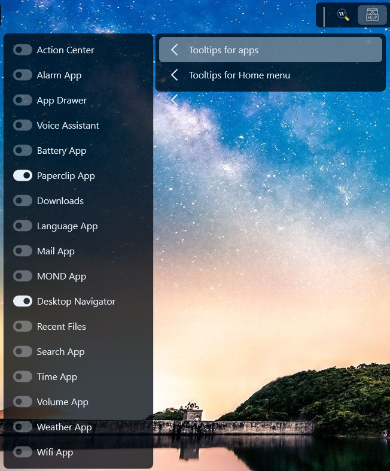
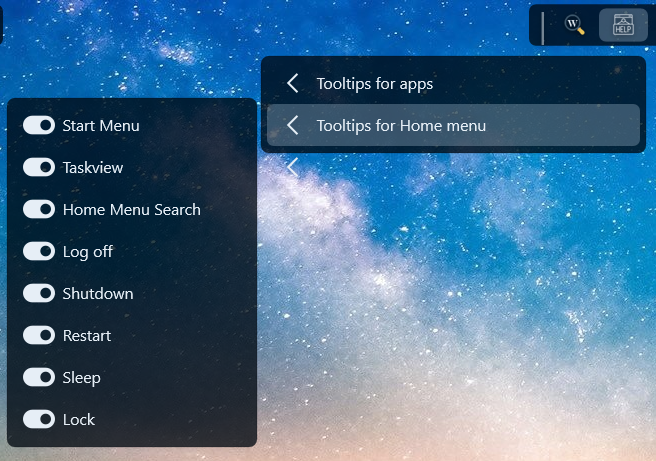

<h1 align="center">
   
  
   
  ToolTipster - TheyCallMePapa
   
</h1>

<h4 align="center">Toggle tooltips on/off in Droptop.</h4>

  
  
  
  

  <a href="#key-features">Key Features</a> •
  <a href="#how-to-use">How To Use</a> •
  <a href="#download">Download</a> •
  <a href="#credits">Credits</a> •
  <a href="#license">License</a>

## Key Features
Can show tooltips for all the built in apps and the icons at the top of the home menu.

## How to use
Download and install the app.  Toggle tooltips on or off.

## Download
https://github.com/papa-boynton/ToolTipster/releases/tag/latest

## Credits
Written by [TheyCallMePapa](https://github.com/papa-boynton).

## License
Creative Commons Attribution-Non-Commercial-Share Alike 3.0
